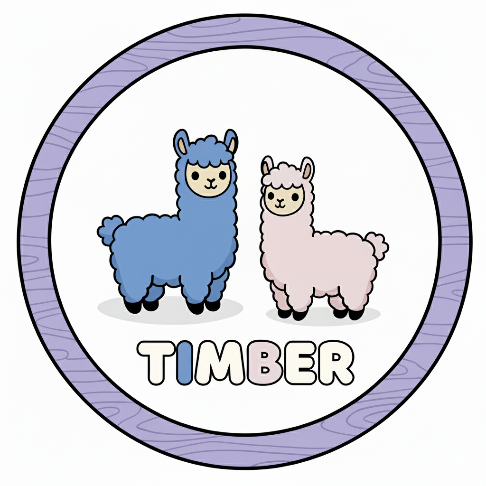
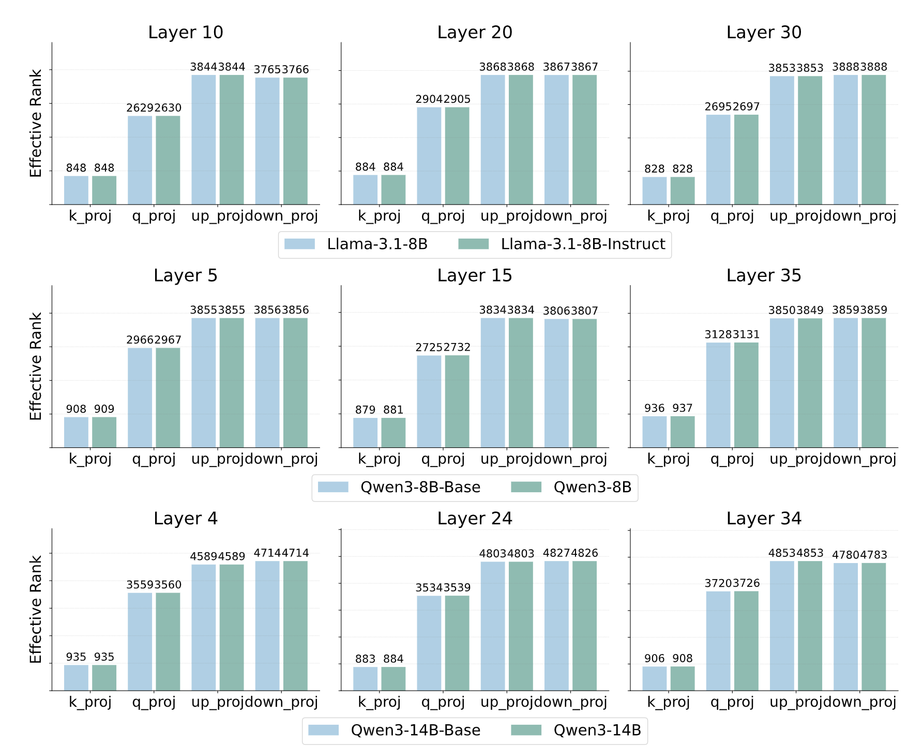

<p align="center">
 <br>
</p>

# Timber

Official code for paper `Timber: Training-free Instruct Model Refining with Base via Effective Rank`

<a href="https://huggingface.co/collections/taki555/timber-68db45e4f4c64c1bfe52b492"><b>[🤗 HF Models]</b></a> •
<a href="https://arxiv.org/abs/2509.23595"><b>[📜 Paper]</b></a> • 
<a href="https://github.com/wutaiqiang/Timber"><b>[🐱 GitHub]</b></a>


This repo contains the code for our paper: <a href="https://arxiv.org/pdf/2509.23595" target="_blank">Timber: Training-free Instruct Model Refining with Base via Effective Rank</a> by <a href="https://wutaiqiang.github.io" target="_blank">Taiqiang Wu</a>, <a href="https://rummyyang.github.io/" target="_blank">Runming Yang</a>, Tao Liu, Jiahao Wang, Zenan Xu, and Ngai Wong.

<!-- \* for equal contributions. -->

<!-- There is an <a href="https://zhuanlan.zhihu.com/p/1922234702594539985" target="_blank"> explanation blog </a> for this paper (in Chinese). -->

# Overview

<p align="center">
 <br>
</p>

-> Ranks from paired Base and Instruct models are
almost the same.

--> Reinforce the hypothesis that post-training is superficial.

---> Post-training improves the exploitation capabilities at the
cost of limiting its exploration

----> Timber, a simple yet effective training-free method by refining the weight deltas.


# Quick Start
## Environment

Please follow the official guidance of [Opencompass](https://github.com/open-compass/opencompass?tab=readme-ov-file#-environment-setup) to set up a python environment.

We use the lmdeploy backend, please remember to set
```
pip install "opencompass[lmdeploy]"
```

## Weight Refine via Timber

Download the official weights from huggingface:

- [Llama](https://huggingface.co/meta-llama)
- [Qwen3](https://huggingface.co/collections/Qwen/qwen3-67dd247413f0e2e4f653967f)

We recommend to download via the huggingface-cli, such as

```
hf download Qwen/Qwen3-30B-A3B --token $your_hf_token --local-dir weights/Qwen3-30B-A3B/Qwen3-30B-A3B
```

Then, run the timber.py:

```
python3 -u timber.py $path/to/base $path/to/instruct $path/to/save --gamma  0.0 --svd_cache_path $your_path/cache.pt
```

where `gamma` is the scale factor and `svd_cache_path` is the cache file for eRank.

## Evaluate

We employ the opencompass for evaluation.

You need to modify the config files first.

For example,  in `Evaluation/llama_1B.py`, replace the `paths` with your folder, modify the `tp` and `num_gpus` to fit your machine.

Then all you need is to run `opencompass Evaluation/llama_1B.py` and wait the final results.

# License

We use the Apache‑2.0 license.  Please also comply with the licenses of any upstream models and datasets.

# ☕️ Citation

If you find this repository helpful, please consider citing our paper:

```
@article{wu2025timber,
  title={Timber: Training-free Instruct Model Refining with Base via Effective Rank},
  author={Wu, Taiqiang and Yang, Runming and Liu, Tao and Wang, Jiahao and Xu, Zenan and Wong, Ngai.},
  journal={arXiv preprint arXiv:2509.23595},
  year={2025}
}
```

For any questions, please pull an issue or email at `takiwu@connect.hku.hk`
